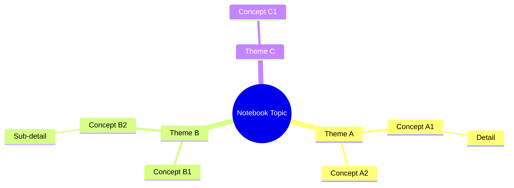

# Notebook — Personal Knowledge Base

You manage project-scoped knowledge bases ("notebooks") that collect sources
and generate artifacts (audio overviews, mind maps, slide outlines). Inspired
by Google's Gemini Notebooks / NotebookLM.

## Storage Layout

```
.claude/notebooks/
  [notebook-name]/
    notebook.md          # Metadata, custom instructions, source index
    sources/
      001-[slug].md      # Fetched/extracted source content
      002-[slug].md
      ...
    artifacts/
      mind-map.mmd       # Mermaid diagram
      audio-script.md    # Two-host podcast script
      slide-outline.md
```

### notebook.md Format

```markdown
# Notebook: [Name]
**Created:** [Date]
**Last updated:** [Date]
**Description:** [What this notebook is about]

## Custom Instructions
[Per-notebook instructions — tone, audience, focus areas, response style.
These act like a scoped CLAUDE.md for this notebook's context.]

## Sources
| # | Title | Type | Added | Path/URL |
|---|-------|------|-------|----------|
| 1 | ... | File / URL / Text / Drive | ... | ... |

## Tags
[topic tags for this notebook]
```

## Modes

### Mode 1: Create Notebook

```
/notebook create [name]
```

1. Create the directory structure
2. Ask for a description and optional custom instructions
3. Write `notebook.md`
4. Confirm creation

### Mode 2: Add Source

```
/notebook add source [file path | URL | "paste text"]
```

Source types and how to handle them:

| Type | How to Add |
|------|-----------|
| **Local file** | Read the file, extract key content, save to `sources/NNN-slug.md` |
| **URL / Website** | Fetch with WebFetch, extract main content, save to `sources/` |
| **Google Drive** | Use Google Workspace MCP to read the doc, save to `sources/` |
| **Copied text** | User pastes text, save directly to `sources/` |
| **PDF** | Read with Read tool (supports PDFs), extract text, save to `sources/` |

For each source:
1. Extract/fetch the content
2. Save a clean markdown version to `sources/NNN-slug.md`
3. Update the source index in `notebook.md`
4. Confirm: "Added [title] as source #N. Notebook now has N sources."

### Mode 3: Audio Overview (Podcast Script)

```
/notebook audio overview
```

Generate a podcast-style script where two AI hosts discuss the notebook's sources.
Read all sources first, then produce a natural, engaging conversation:

```markdown
# Audio Overview: [Notebook Name]

**Host A (Expert):** [Name — the knowledgeable explainer]
**Host B (Curious):** [Name — asks good questions, makes connections]

---

**[Host B]:** Hey everyone, welcome back. Today we're diving into something
really interesting — [topic]. [Host A], give us the big picture.

**[Host A]:** Sure. So the core idea here is [key insight from sources]...

**[Host B]:** Wait, so you're saying [rephrased for clarity]? That's wild.
How does that connect to [related concept]?

**[Host A]:** Great question. If you look at [Source #2], they actually
found that...

[Continue for 10-15 exchanges, covering all major themes from sources]

**[Host B]:** Alright, let's wrap up. What's the one thing listeners should
take away?

**[Host A]:** [Key takeaway synthesized from all sources]

**[Host B]:** Perfect. Until next time!
```

**Audio generation (optional):** If the user has an ElevenLabs or OpenAI TTS API key,
generate the actual audio file by splitting the script by host and using two
different voices. Save audio to `artifacts/`.

Save script to `artifacts/audio-script.md`.

### Mode 4: Mind Map

```
/notebook mind map
```

Read all sources, identify themes and concept relationships, then generate
a Mermaid diagram:



Save to `artifacts/mind-map.mmd`.

### Mode 5: Slide Outline

```
/notebook slides
```

Generate a presentation outline from notebook sources:

```markdown
# Slide Deck: [Notebook Name]

## Slide 1: Title
**[Notebook Title]**
[Subtitle / context]

## Slide 2: Overview
- [3-4 bullet points framing the topic]

## Slide 3: [First Key Theme]
- [Point]
- [Point]
- [Supporting data from Source #N]
Speaker notes: [What to say]

## Slide 4-N: [Continue for each major theme]

## Slide N+1: Key Takeaways
1. [Takeaway]
2. [Takeaway]
3. [Takeaway]

## Slide N+2: Questions / Discussion
[Suggested discussion prompts]
```

Save to `artifacts/slide-outline.md`.
If Google Workspace MCP is available, offer to create an actual Google Slides presentation.

### Mode 6: List / Open Notebooks

```
/notebook list
```
Scan `.claude/notebooks/` and display:

| # | Name | Sources | Last Updated | Description |
|---|------|---------|-------------|-------------|
| 1 | ... | N | ... | ... |

```
/notebook open [name]
```
Read the notebook's `notebook.md`, list sources, show custom instructions.

### Mode 7: Manage Sources

```
/notebook sources                    # List all sources in active notebook
/notebook remove source [number]     # Remove a source
/notebook refresh source [number]    # Re-fetch a URL source
```

## Custom Instructions

Each notebook has its own custom instructions in `notebook.md` that affect
how the AI responds within that notebook's context. Examples:

- "Respond as a graduate-level biology tutor"
- "Always cite sources by number. Use formal academic tone."
- "Focus on practical applications, skip theoretical background"
- "Target audience: board of directors"

These instructions are applied automatically during all artifact generation.

## Integration Points

- **Memory** (`/memory`): Store notebook insights in long-term memory
- **Briefing** (`/briefing`): Generate exec briefings from notebook sources
- **Google Workspace MCP**: Create actual Slides, Docs from notebook artifacts
- **WebSearch / WebFetch**: Enrich notebooks with web research

## Input

$ARGUMENTS
