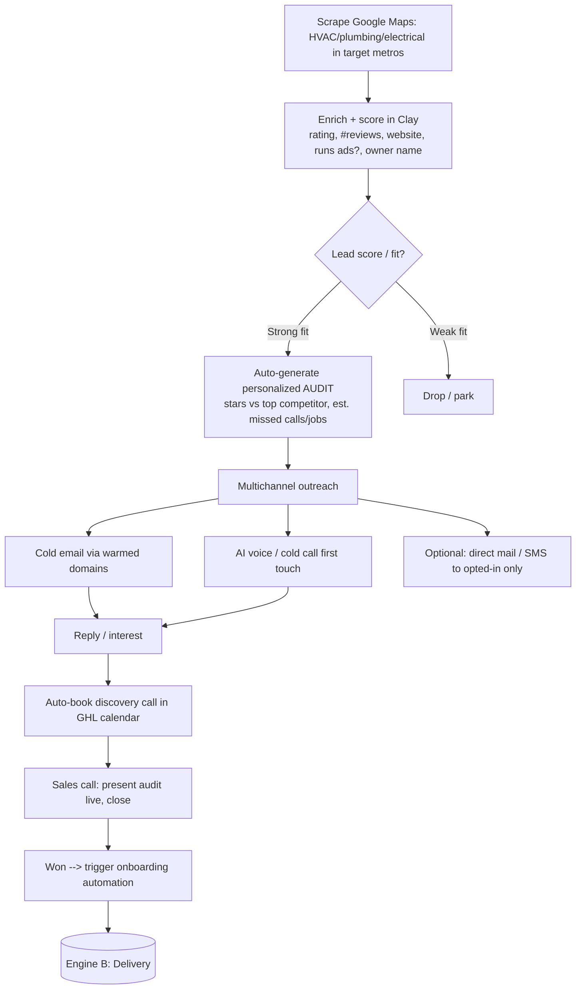
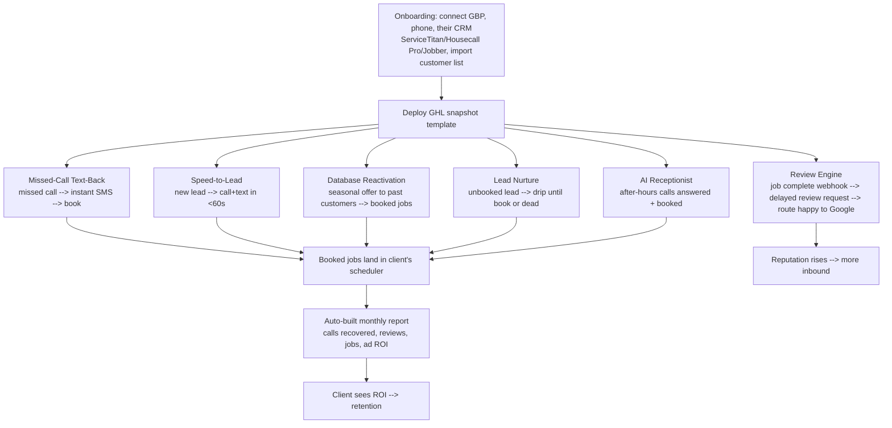

# Home Services Marketing Agency — End-to-End Automation Workflow
### Vertical: HVAC · Plumbing · Electrical

This document covers the two automation engines that run the business:

- **Engine A — Client Acquisition** (how you get contractors as clients, highly automated)
- **Engine B — Delivery / Fulfillment** (the product you run *for* each client)

Plus the **tech stack**, a **build order**, and the **compliance guardrails** that keep you out
of legal and deliverability trouble.

---

## The tech stack (the "spine")

| Layer | Tool(s) | Role |
|---|---|---|
| **Agency CRM + delivery hub** | **GoHighLevel (GHL)** | Purpose-built for this model: CRM, SMS/email, review requests, missed-call text-back, funnels, reporting, white-label client logins. This is your core. Use sub-accounts (one per client) + a snapshot template. |
| **Outreach sending** | Smartlead or Instantly | Cold email at scale across warmed domains/inboxes. |
| **Lead sourcing + enrichment** | Google Maps scraper (e.g. Outscraper) + Clay | Pull local trades businesses + enrich with rating, review count, ads presence, owner name. |
| **AI voice** | Vapi or Bland.ai | First-touch outbound calls (acquisition) + 24/7 AI receptionist (delivery). |
| **Telephony / call tracking** | Twilio + CallRail | Powers missed-call text-back, speed-to-lead dialing, and call attribution. |
| **Workflow glue** | Make.com (start here) → n8n (self-host later to cut cost) | Connects scrapers, Clay, GHL, client CRMs (ServiceTitan/Housecall Pro/Jobber), reporting. |
| **Ads** | Google Local Services Ads + Google Ads (+ Meta at Tier 3) | Lead generation for clients. |
| **Reporting** | Looker Studio (or GHL native dashboards) | Auto-built monthly client reports. |
| **Payments** | Stripe | Auto-billing retainers + setup fees. |

> **Why GoHighLevel is the keystone:** it collapses ~80% of the delivery stack into one platform
> and lets you clone an entire client setup ("snapshot") in minutes. That cloneability is what
> makes the business scale.

---

## Engine A — Client Acquisition (automated outreach)

### Step-by-step

**1. Source leads.**
Scrape Google Maps for `HVAC contractor`, `plumber`, `electrician` in your target metros.
Capture: business name, owner name (enrich via Clay), phone, website, GBP star rating, review
count, and whether they're running ads.

**2. Enrich + score in Clay.**
Score each lead for fit. *Counter-intuitively, a low rating / low review count is a GOOD prospect*
— it means obvious upside you can point to. Flag: `< 4.5 stars`, `< 75 reviews`, `no website`, or
`not running LSA` as high-opportunity.

**3. Auto-generate the personalized audit (your secret weapon).**
For each prospect, automatically assemble a tiny audit: *"You're at 4.1★ with 38 reviews. [Top
competitor] is at 4.8★ with 220. Based on your call volume you're likely missing ~15–20 calls a
month — that's roughly $X in jobs walking to competitors."* This "show, don't tell" first touch
converts **far** better than a generic pitch. Deliver it as a short Loom-style video or a one-page
PDF/landing page, generated per prospect via Make + a template.

**4. Multichannel outreach (in priority order for trades).**
- **Email** (primary scale channel) via Smartlead/Instantly on **separate warmed domains** — never
  your main domain. ~20–30 sends/inbox/day, rotated across many inboxes.
- **Phone / AI voice** (very high-converting for trades — owners live on the phone, not LinkedIn).
  Vapi/Bland can run first-touch qualification calls and book interested owners.
- **LinkedIn is low-value here** — trades owners aren't on it. Skip or deprioritize.
- **Direct mail** can work as a premium touch for high-value targets.

**5. Reply handling → booked call.**
Replies route into GHL. Interested prospects self-book a discovery call via the embedded calendar;
no-shows get automated reminders + reschedule sequences.

**6. Close → trigger onboarding.**
On "won," a webhook fires the onboarding automation in Engine B (creates the GHL sub-account from
your snapshot, sends the intake form + welcome sequence).

**Target outreach math (illustrative):**
`5,000 contacted → 8% reply (400) → 25% book a call (100) → 25% close (25 clients)`.
Tune each rate; the audit-first approach is what lifts reply and close rates.

---

## Engine B — Delivery / Fulfillment (the product you run per client)

This is the recurring machine that runs inside each client's GHL sub-account.

### The six delivery automations

1. **Onboarding automation.** Intake form collects GBP access, phone setup, CRM type, and a CSV/API
   pull of past customers. Triggers GHL snapshot deployment so every client is configured identically.

2. **Missed-Call Text-Back.** Missed/abandoned inbound call → instant SMS → conversation → booking.
   The single fastest "found money" win; recovers jobs that otherwise go to a competitor.

3. **Speed-to-Lead.** Any new lead (web form, LSA, ad) triggers an auto-call connecting the
   contractor to the lead + a text within 60 seconds. Speed-to-lead is the #1 driver of booking rate.

4. **Review Engine.** Job marked complete in their CRM (ServiceTitan/Housecall Pro/Jobber webhook
   via Make) → wait a few hours → SMS/email review request → 4–5★ routed to Google, 1–3★ routed to a
   private feedback form (protects their public rating).

5. **Database Reactivation.** Segment the imported customer list (e.g., "no service in 12+ months,"
   "AC installed 8+ yrs ago") and run seasonal offers (spring AC tune-up, winter heating safety
   check). Recurring seasonal triggers keep it producing year-round.

6. **AI Receptionist.** After-hours / overflow calls answered by an AI voice agent that qualifies
   and books into the scheduler — critical for emergency trades (burst pipe at 11pm = $$$).

7. **Reporting.** Make pulls GBP, CallRail, and ad data into a Looker Studio template, auto-sent
   monthly. Always headline the numbers the owner cares about: **calls recovered, reviews gained,
   jobs booked, ad ROI.**

---

## Build order (don't boil the ocean)

1. **Week 1–2:** Stand up GoHighLevel. Build ONE delivery snapshot (missed-call text-back + review
   engine + reactivation). Build the reporting template.
2. **Week 2–4:** Land 1–2 clients *manually* (network, a free/cheap pilot). Run the delivery
   playbook by hand to find the rough edges. **Do not automate what you haven't done manually.**
3. **Week 4–6:** Productize delivery into the snapshot + Make scenarios. Write SOPs.
4. **Week 6–8:** Build Engine A — domains + warmup, Clay enrichment, the audit generator, the email
   sequences. Start at ~30–50 sends/day.
5. **Month 3+:** Add Speed-to-Lead, AI Receptionist, LSA management (Tier 2). Layer in inbound
   (case-study content + a small paid campaign) so you're not forever cold.

---

## ⚠️ Compliance & deliverability guardrails (read this)

Getting "highly automated" wrong here means blacklisted domains and legal exposure. Non-negotiables:

- **Cold email (CAN-SPAM):** real physical address in every email, working one-click unsubscribe
  that you *honor*, no deceptive subject lines. Use **separate warmed domains**, verify every
  address (NeverBounce), keep volume low per inbox. Deliverability — not lead volume — is your real
  bottleneck.
- **Cold calling (TCPA + DNC):** calling a business's published line is generally defensible, but
  scrub against Do-Not-Call where applicable and respect opt-outs. AI voice agents must disclose
  and behave lawfully.
- **Cold SMS is high-risk (TCPA):** **do not** cold-text prospects without consent — statutory
  damages are steep. SMS is for *opted-in* audiences only (i.e., the client's own past customers in
  Engine B, who still get opt-out language).
- **Delivery-side messaging:** a client's past customers have an existing relationship, but every
  SMS/email still needs clear opt-out. Configure this in the GHL snapshot once.
- **Records:** keep suppression/unsubscribe lists synced across all sending tools.

When in doubt, prefer *opted-in and email/phone* over *cold SMS*, and keep sending reputation
sacred. A burned domain costs you weeks; a TCPA complaint costs real money.

---

## Quick reference — what to buy first

`GoHighLevel (agency plan)` · `Make.com` · `Smartlead or Instantly` + a few sending domains ·
`Clay` · `Outscraper` (or similar) · `Twilio` + `CallRail` · `Stripe`. Add `Vapi/Bland` and
`Looker Studio` once you have paying clients. Self-host `n8n` later to cut Make costs at scale.
